# How to Connect OKX API Keys to CryptoRobotics Terminal

Setting up automated crypto trading? You need to link your exchange account first. This guide shows you exactly how to generate OKX API keys and connect them to CryptoRobotics—no confusing jargon, just the actual steps that work.

---

<figure><iframe title="Cryptorobotics Terminal API Integration to OKEX Crypto Exchange" src="https://www.youtube.com/embed/PddTXWGBOWc?feature=oembed"></iframe></figure>

To get CryptoRobotics terminal talking to your OKX exchange account, you'll need an API key. Think of it as a secure handshake between the two platforms—your trading terminal can execute trades without you manually logging into the exchange every time.

## Getting Your API Key from OKX

Head over to the OKX website. Look for your profile icon in the upper right corner and click it. You'll see an **API keys** option in the dropdown menu.

Once you're in the API section, click the **Create APIs** button.

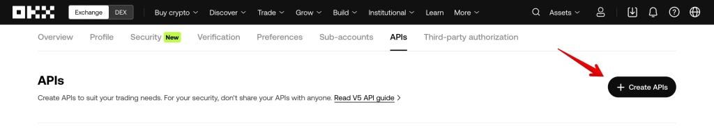

A form pops up. Here's what you need to fill in:

- **API name** — Give it whatever name makes sense to you
- **Purpose** — Select "API trading"
- **Permissions** — Tick the **Trade** box (this lets the terminal actually execute trades)
- **Passphrase** — Create a passphrase between 6-32 characters. You'll need this later, so save it somewhere safe
- Click **Submit all** when you're done

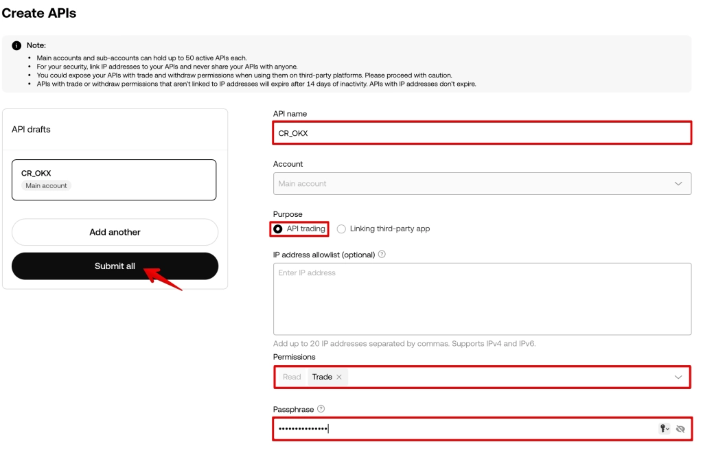

OKX will ask you to confirm with whatever authentication method you've set up—could be email, SMS, or authenticator app.

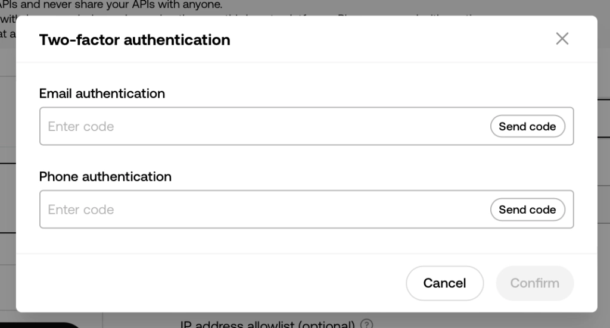

Here's the important part: OKX will show you your API credentials. Copy everything and save it somewhere secure. 👉 [Looking for a reliable exchange to power your automated trading strategies?](https://www.okx.com/join/47044926) Once you confirm, you won't see the secret key again.

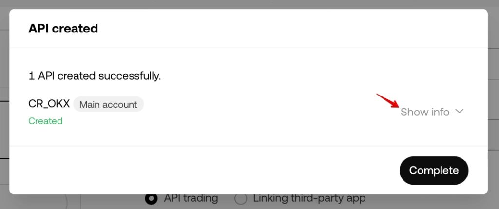

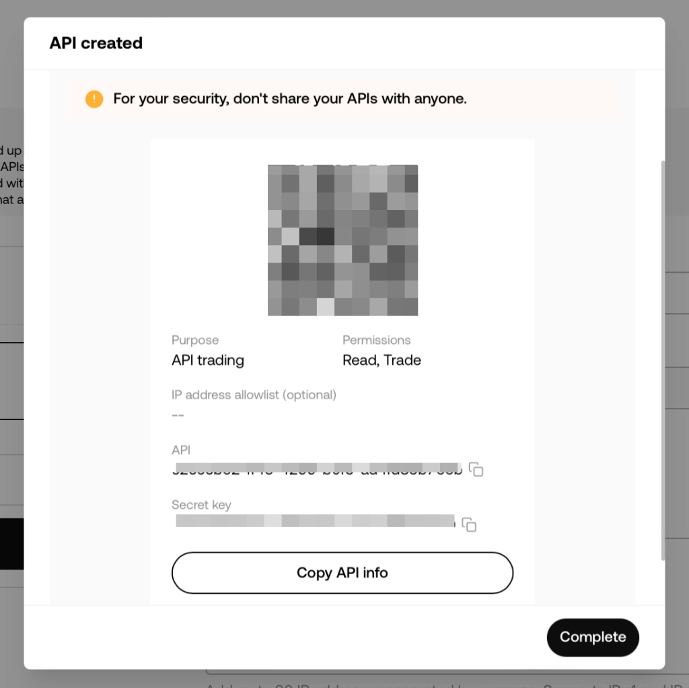

Your new key appears in a table below. Click **View** to access all the integration data you'll need.

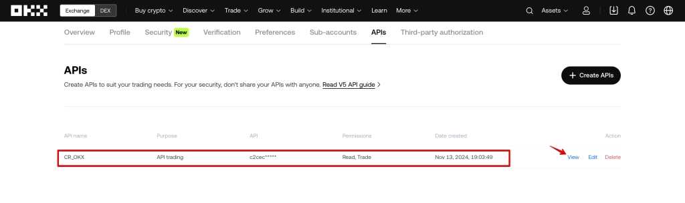

## Adding the Key to CryptoRobotics

Now switch over to your CryptoRobotics terminal. Go to **Account** → **Exchange Accounts**. If you haven't connected any exchanges yet, you'll see a **Connect Exchange** button at the bottom of the screen.

Click the **+Add New Key** button in the upper right.

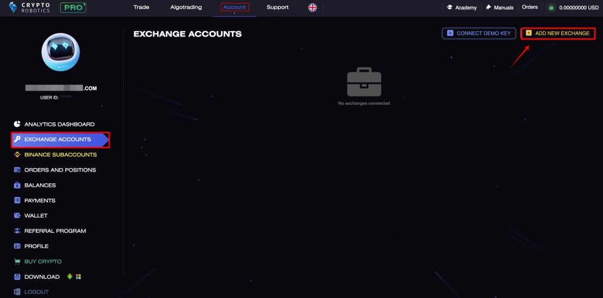

A form appears asking for:

- **API Key** — Paste what you copied from OKX
- **Secret Key** — Same deal
- **Passphrase** — The one you created earlier
- **Key name** — Whatever helps you remember which account this is

Once everything's filled in, click **+Add new exchange**.

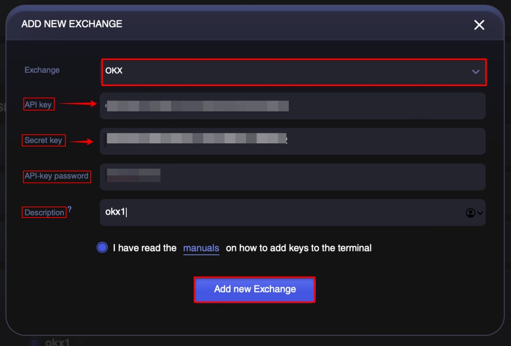

Give it a few seconds to verify. If everything checks out, your OKX account appears in the connected exchanges list.

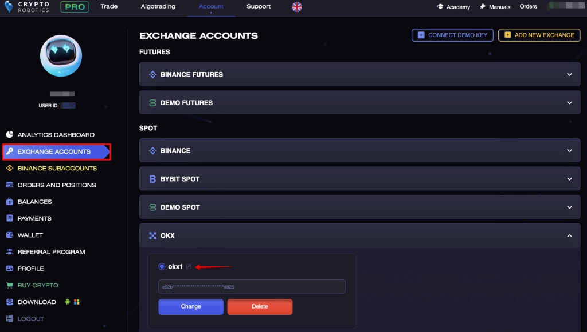

## One Last Thing: Moving Your Funds

When you first deposit funds to OKX, they land in your Funding Account. But to actually trade, you need them in a Trading account.

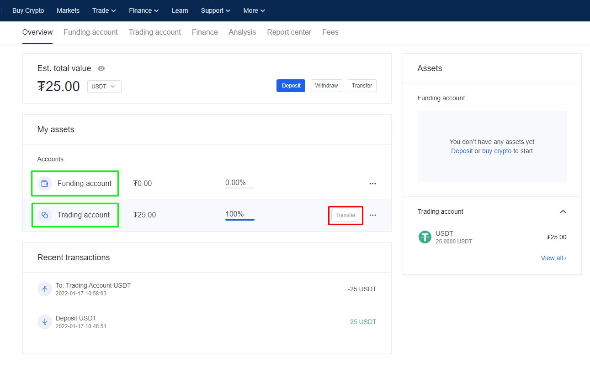

Hit the **Transfer** button and a window pops up letting you move funds between accounts.

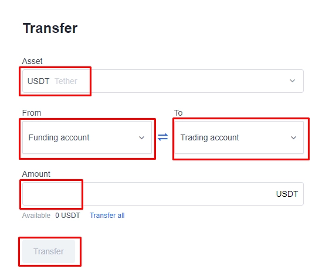

After the transfer completes, you're all set. CryptoRobotics can now execute trades on your OKX account.

---

That's it—your automated trading setup is ready to go. The whole process takes maybe 10 minutes if you're moving at a reasonable pace. The key thing is keeping your API credentials secure and making sure you've enabled the right permissions. Once everything's connected, you can start running bots and strategies without having to manually place every single order. If you're serious about algorithmic trading, [connecting OKX through CryptoRobotics gives you the infrastructure to automate your strategies effectively](https://www.okx.com/join/47044926).
